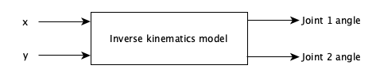
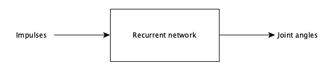

# 2DoFTrajectoryPrediction

## 1 Description

A recurrent network should be implemented and trained with FORCE learning by Laje & Buonomano to predict joint trajectories for a 2DoF manipulator. Therefore, the following subtasks have to be implemented:
1.	Generating cartesian trajectories from given cartesian coordinates. The input coordinates should represent simple figures, e.g. a house, or a triangle.
2.	Inverse kinematics model: transform cartesian to joint angles
3.	Train recurrent layer
4.	Train readout layer
5.	Forward kinematics: transform joint angles to cartesian coordinates
6.	Optimization, result discussion

For that, the network receives impulses as input. Depending on different impulse types (e.g. one-hot-encoded or timing), the corresponding figures should be generated as time series (joint angles). These joint angles should be converted back into cartesian coordinates for visualization purposes.

## 2 Experimental Setup

